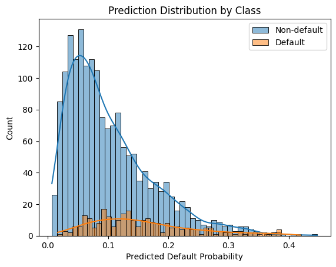

# Bayesian Modeling for Uncertainty-Aware Credit Risk Decisions

Wendy Zhao, Zimeng Yang, Yiqin He

# Project Overview

This project studies borrower default risk prediction using large-scale credit data. The objective is to estimate the probability that a borrower will default on a loan and use these probabilities to support lending decisions such as:

- Loan approval or rejection  
- Loan amount allocation  
- Interest-rate tiering  

Rather than treating credit risk as a deterministic classification problem, we frame it as an uncertain probabilistic inference problem, where each borrower is assigned a probability of default.

These probability estimates allow lenders to make risk-aware decisions under asymmetric costs, where approving a risky borrower may lead to significant losses while rejecting a good borrower leads to opportunity cost.

# Task Description

The primary modeling task is binary classification of loan outcomes, where the model estimates:

$$P(\text{default} = 1 \mid \text{borrower features})$$

This probabilistic approach allows downstream decision rules to be adjusted depending on the lender’s risk tolerance.

# Data 

This section describes the dataset used in this project. We use the Lending Club Loan Dataset, which contains detailed loan-level information on borrower characteristics, credit history, loan attributes, and repayment outcomes. The dataset provides a real-world view of consumer lending behavior and credit performance. For the purpose of this study, these variables are used to construct a binary default indicator and serve as inputs for modeling borrower default risk.

## Source

We use the Lending Club Loan Dataset, obtained from Kaggle:
 
https://www.kaggle.com/datasets/adarshsng/lending-club-loan-data-csv/data

It originates from Lending Club, a U.S.-based peer-to-peer lending platform that connects individual investors with borrowers. Investors provide capital for loans, and borrowers repay the loan principal with interest over time.

## Dataset Description

The dataset contains:

- ~890,000 loan observations
- ~75 borrower and loan-level variables
- Historical loan performance data

Key feature groups include:

### Borrower Demographics
- income
- employment length
- home ownership status
- geographic location

### Credit Characteristics
- credit history length
- delinquency history
- credit inquiries
- credit utilization ratios

### Loan Attributes
- loan amount
- interest rate
- loan grade
- loan purpose

### Repayment Outcomes
Loan performance indicators such as:

- Fully Paid
- Current
- Late
- Charged Off
- Default

These repayment status indicators are further constructed into a **binary default** variable used for modeling.

# Methodology

 This part describes the methods we used to estimate the borrowers' default risk. The analysis begins with data preprocessing to clean and prepare the Lending Club dataset for modeling. After preprocessing and sampling, model-specific feature engineering was applied to prepare the dataset for different modeling approaches. Finally, two models were implemented to estimate borrower default risk: a Bayesian Logistic Regression model, which provides interpretable probabilistic inference, and a TabPFN model, a transformer-based approach designed for tabular prediction.

## Data Pre-processing

- Columns with extremely high missing rates were removed (>95% missing values).
- Post-origination variables that could cause data leakage (such as repayment outcomes or post-loan payment variables) were excluded.
- Lending Club internal risk evaluation score (such as grade, sub-grade) were excluded.
- Joint loan applications were filtered out to simplify the modeling framework.

These steps ensure that the model only uses information available at the time of loan approval.

## Data Sampling

Because the original dataset contains more than two million observations, a random subset of the data was used for experimentation.

 - 50,000 observations were randomly sampled from the cleaned dataset.

 - To reduce computational cost for TapPFN construction, 20,000 observations were used for training and model experimentation.

All sampling preserves the original class distribution of default and non-default observations.

## Model

We implement and compare two approaches for predicting borrower default risk: 

- a **Bayesian logistic regression** model and

- **TabPFN** (Tabular Prior-Data Fitted Network).

### Bayesian Logistic Regression 

 Bayesian Logistic Regression models the binary loan outcome using a *Bernoulli likelihood* with a *logistic link function*. In this framework, the probability of default is determined by a linear combination of borrower features transformed through the logistic function. Unlike classical logistic regression, Bayesian logistic regression places probability distributions (priors) on the regression coefficients. During training, these priors are updated using the observed loan data to produce posterior distributions over the parameters. Predictions are then obtained by evaluating the posterior predictive distribution, which provides both estimated default probabilities and uncertainty about the model parameters. This approach offers strong interpretability, as the influence of each feature on default risk can be directly examined through the posterior coefficient estimates.

### TabPFN 
 TabPFN is a *transformer-based* foundation model designed for tabular data. Rather than learning model parameters solely from the given dataset, TabPFN has been pre-trained on a large number of synthetic tabular tasks. The model learns a general strategy for solving tabular classification problems and applies this strategy to new datasets through a process similar to in-context learning. During prediction, the model receives the training data and unlabeled samples as input and directly outputs predicted probabilities of default. Further information could be found: [
TabPFN-v2-clf](https://huggingface.co/Prior-Labs/TabPFN-v2-clf)

By comparing these two models, we evaluate the trade-off between interpretability and uncertainty-aware inference offered by Bayesian logistic regression and the predictive power of modern transformer-based models for tabular data. This comparison allows us to assess whether advanced deep learning methods provide meaningful improvements over traditional statistical approaches in credit risk prediction.

## Model Specific Feature Engineering

### Bayesian Logistic

### TabPFN

Although TabPFN is designed to work effectively on tabular datasets with minimal preprocessing, certain feature engineering steps were still applied to ensure the dataset is suitable for modeling and to improve computational stability. The following preprocessing steps were therefore applied before training the TabPFN model:

- Categorical variables were encoded using one-hot encoding.
- High-cardinality features such as ZIP codes were aggregated into broader geographic categories.
- Missing values in selected credit-history variables were handled using indicator variables and placeholder values.
- Other missing values were handled using domain-informed imputation strategies.

These feature engineering steps help ensure that the model receives structured and interpretable inputs while reducing noise and sparsity in the dataset. Aggregating high-cardinality variables prevents the model from overfitting to extremely rare categories, while one-hot encoding allows categorical information to be represented without imposing artificial numerical relationships. Handling missing values through indicator variables also preserves potentially informative signals, such as the absence of prior delinquency records. Together, these preprocessing choices improve model stability and allow the TabPFN model to better capture meaningful patterns in borrower credit behavior.

Additionally, due to computational constraints, the dataset was further sampled to 20,000 observations for training the model while preserving the original default and non-default class distribution.

# Result (Need to change)

Two models were implemented to estimate the probability that a borrower will default given the borrower’s characteristics: **Bayesian Logistic Regression (BLR)** and **TabPFN**. Although both models aim to estimate the same default probability, they differ in how the probability is learned and inferred. BLR relies on a probabilistic statistical framework with interpretable parameters, while TabPFN leverages a pretrained transformer architecture designed for tabular prediction. The results from these models are evaluated using several metrics and diagnostic plots, and their performance and trade-offs are compared in the following sections.

The primary evaluation metric used in this project is the **Area Under the Receiver Operating Characteristic Curve (ROC-AUC)**. ROC-AUC measures the model’s ability to rank borrowers according to their risk of default across all possible classification thresholds. Because the objective of this project is to estimate default probabilities rather than to make a fixed approval or rejection decision, the ranking ability of the model is more informative than metrics that depend on a single decision threshold. A higher ROC-AUC indicates that the model more consistently assigns higher predicted risk to borrowers who actually default compared to those who do not.

In addition to ROC-AUC, two diagnostic visualizations were used: **calibration curves** and **prediction distribution plots**. The calibration plot compares predicted default probabilities with observed default frequencies, indicating how well predicted risks match actual outcomes. The prediction distribution plot shows how predicted probabilities differ between default and non-default borrowers, illustrating the model’s ability to separate risky borrowers from safer ones.

## Bayesian Logistic

### Model Description

We implemented a Bayesian logistic regression model as an interpretable baseline for credit risk prediction. Logistic regression is a natural choice for binary default prediction because it directly models the probability of default through a sigmoid transformation of a linear combination of borrower features. In the Bayesian framework, model parameters are treated as random variables with prior distributions, which allows us to quantify uncertainty in coefficient estimates and predicted probabilities. In this implementation, we used weakly informative Normal priors for the intercept and coefficients and performed posterior inference using variational inference (ADVI), which provides an efficient approximation to the posterior distribution.

To improve numerical stability and model performance, several preprocessing steps were applied. Continuous variables were standardized, categorical variables were encoded using one-hot encoding, and missing-value placeholders (e.g., 999) were converted to NaN before imputation. In addition, post-origination variables that would introduce target leakage were removed. The final feature set focuses on borrower characteristics and credit profile variables available at the time of loan issuance.

### Model Performance

The Bayesian logistic model achieved an AUC of 0.696, which indicates a moderate ability to rank higher-risk borrowers above lower-risk ones. The Brier score of 0.107 suggests that the predicted probabilities are reasonably well calibrated overall. The calibration curve further supports this observation: predicted probabilities generally follow the diagonal reference line, indicating that the model’s probability estimates are consistent with the observed default frequencies across probability bins.

However, the confusion matrix highlights an important challenge typical in credit risk modeling: class imbalance. The dataset contains substantially more non-default cases than default cases. As a result, using a standard threshold of 0.5 leads to very high accuracy (0.869) driven mainly by correct predictions of non-defaults, but extremely low recall for defaults (0.007). In other words, the model rarely predicts default at the 0.5 threshold, which limits its usefulness for operational risk detection. This does not necessarily indicate poor model quality; rather, it reflects the mismatch between the threshold and the base rate of default events.

### Top Coefficient Summary

To understand which borrower characteristics most strongly influence the predicted probability of default, we examined the posterior mean coefficients of the Bayesian logistic regression model. Because the model is linear in the log-odds space, larger positive coefficients indicate factors associated with higher default risk, while negative coefficients correspond to lower risk.

Among the positive coefficients, the strongest risk indicators are related to loan purpose and credit grade. In particular, loans issued for small business purposes exhibit the largest positive coefficient (β ≈ 0.61), suggesting that these loans carry substantially higher default risk compared to other loan purposes. Similarly, lower credit grades such as grade F and grade E subgrades (e.g., E1, E2, D3) are strongly associated with increased default probability. This pattern is consistent with the LendingClub credit grading system, where lower grades reflect weaker borrower credit profiles. Additionally, a higher debt-to-income ratio (DTI) also increases default risk, which aligns with the intuition that borrowers with heavier debt burdens are more likely to experience repayment difficulties.

On the other hand, several variables are associated with lower predicted default risk. The most prominent negative coefficient corresponds to DirectPay disbursement, which significantly reduces predicted default probability (β ≈ −1.83). This likely reflects the fact that DirectPay loans are often used to pay off existing credit card balances directly, thereby reducing borrower liquidity risk. Higher credit grades, especially grade A and subgrades A1–A3, also show strong negative coefficients, indicating that borrowers with stronger credit profiles are substantially less likely to default. Additionally, longer employment tenure (e.g., six years of employment) and certain verification statuses appear to reduce predicted risk.

## TabPFN

Here is the link to the notebook has the complete workflow to train a TabPFN, including EDA, data preprocessing, modeling, and performance evaluation.

### ROC-AUC

Test ROC-AUC: 0.7075

An AUC value of approximately 0.71 indicates that the model has a meaningful ability to distinguish between borrowers who default and those who do not. In probabilistic terms, this means that given a randomly selected pair of borrowers—one who defaulted and one who did not—the model assigns a higher predicted default probability to the defaulter about 71% of the time.

This level of performance suggests that the model captures relevant patterns in borrower credit characteristics and loan attributes, although the classification boundary between risky and safe borrowers is not perfectly separable.

### Prediction Distribution

The blue distribution represents non-default loans, while the orange distribution represents defaulted loans. Non-default borrowers are concentrated at lower predicted probabilities, typically below 0.15, while defaulted borrowers tend to have higher predicted probabilities and a longer right tail extending toward higher risk levels.

Although the two distributions overlap, there is a noticeable shift to the right for the default class, indicating that the model successfully assigns higher predicted risk to borrowers who ultimately defaulted.

### Calibration Analysis

The dashed diagonal line represents perfect calibration, where predicted probabilities match the actual default frequency. The model performs reasonably well in the lower probability region, where most borrowers are located. However, in the medium probability range the model tends to underestimate the true default rate, suggesting that higher-risk borrowers may have slightly greater default risk than the model predicts.

Despite this slight underestimation, the calibration pattern indicates that the model provides useful probabilistic risk estimates rather than purely ranking borrowers.

## Comparison

### Model Performance Metrics

# Conclusion

# Limit and Future Work

